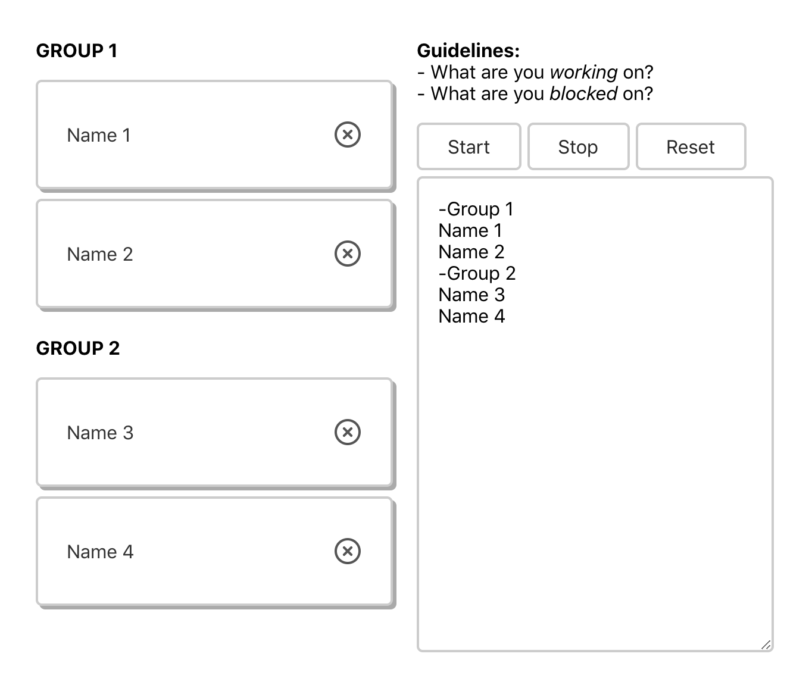

# Standup App

## Usage

To automatically add list items, append the url with a query string with the key "list".

You can also prepend a list item with "-" to have a separator.

Example:

```
?list=-group1,name1,name2,-group2,name3,name4
```

Screenshot:



## License

MIT
